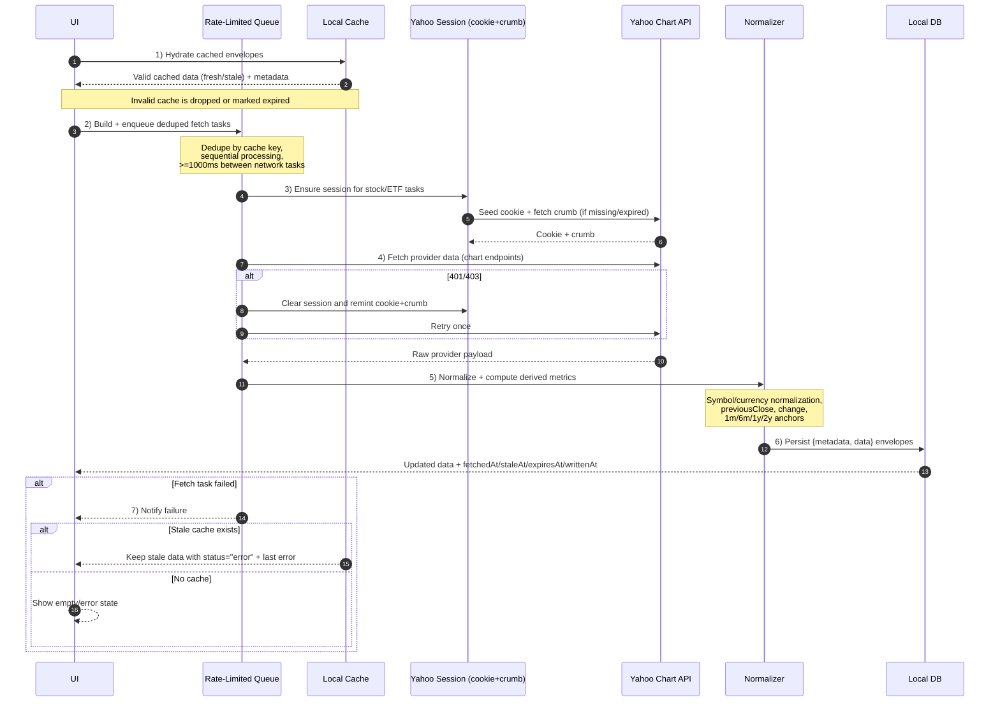

# Protocols

Active cross-module behaviors. Data shapes referenced below are defined in `contracts.md`.

## Market Data Retrieval

Single shared retrieval flow per running client process. Used by all three MVP clients.

### Provider

- Yahoo Finance is the only provider in MVP.
- Stay open to alternates by always recording `provider` in cached metadata so future migrations can route by source.

### Endpoints In Use

#### Session cookie seed

```
https://fc.yahoo.com/
```

- Fetch with `redirect: "manual"`.
- Read `Set-Cookie` headers from the redirect response. Body is not used.
- Take each cookie's first `name=value` segment and join with `; ` to build a `Cookie` header.

#### Crumb token

```
https://query2.finance.yahoo.com/v1/test/getcrumb
```

- Send the `Cookie` header from the seed step plus a browser-like `User-Agent`.
- Read body as text.
- Reject empty bodies and the literal string `null`.

#### Stock and ETF chart

```
https://query1.finance.yahoo.com/v8/finance/chart/{symbol}?period1={period1}&period2={period2}&interval=1d&events=div&crumb={crumb}
```

- Used in MVP for: S&P 500 (`^GSPC`).
- `period1` is approximately two years before now plus `14` padding days.
- `period2` is now.
- `interval=1d` is enough for dashboard purposes.
- `events=div` returns dividend events.
- One response yields current quote fields and historical anchors `1m`, `6m`, `1y`, `2y`.
- Send `Cookie` and `User-Agent` headers.

#### Currency chart

```
https://query1.finance.yahoo.com/v8/finance/chart/{forexSymbol}?range=2d&interval=1d
```

MVP forex symbols:

```
EURUSD=X
GBPUSD=X
```

- Yahoo `EURUSD=X` means `1 EUR in USD`.
- The app shows USD-relative rates with USD pinned at `1`.
- Read `meta.regularMarketPrice` and `meta.chartPreviousClose`.
- Invert pairs when the displayed direction is `1 USD in target currency`.
- Compute the daily percent change from the inverted values so the UI move is from the USD perspective.

#### Gold quote chart

```
https://query1.finance.yahoo.com/v8/finance/chart/GC=F?range=1d&interval=1d
```

- `GC=F` is Yahoo's gold futures symbol.
- Read `meta.regularMarketPrice`, `meta.chartPreviousClose`, `meta.currency`, and `meta.symbol`.
- Compute absolute and percent change.

#### Gold history chart

```
https://query1.finance.yahoo.com/v8/finance/chart/GC=F?period1={period1}&period2={period2}&interval=1d
```

- Same two-year-plus-padding window as stocks.
- Daily closes feed the `1m`, `6m`, and `2y` anchors.
- No `events=div`; gold futures have none.

#### External UI link

```
https://finance.yahoo.com/quote/{symbol}/
```

- UI-only deep link. Not used for ingestion.

### Session and Crumb Handling

- Cache `{cookie, crumb}` together for `30 minutes`.
- Stock and ETF chart calls require the session. Currency, gold quote, gold history, and gold quote chart do not.
- On HTTP `401` or `403` from a chart call, discard the session, mint a new cookie + crumb pair, and retry the same request once. Do not retry further on the next failure.

### Rate-Limited Fetch Queue

- Single shared queue per client process.
- Process tasks sequentially.
- Wait at least `1000ms` between network tasks.
- Deduplicate enqueued tasks by `cache key`, not by symbol. The same symbol can have separate quote and history tasks, but two enqueues of the same key collapse into one.
- Maintain progress counters: `totalCount`, `completedCount`, `running`, `currentLabel`.
- Allow clearing or aborting pending tasks when a full refresh starts.
- Append a flush task after batches so cache writes amortize. Flush about every `5` successful quote fetches and once at the end.

### Normalization

- Trim and uppercase symbols before requesting.
- Convert provider responses into `MarketQuote` and `HistoricalPriceSeries` from `contracts.md`.
- Normalize subunit currencies before storing or computing changes (`GBp` -> `GBP`, `ILA` -> `ILS`, divide price by `100`).
- Compute `previousClose`, `change`, `changePercent`, and `change1m/6m/1y/2y` from the normalized daily series. Do not trust provider `chartPreviousClose` for these fields; it can be stale on long ranges.

### Freshness TTLs

These TTLs control cache `status` derivation. They are independent of UI refresh triggers; mobile MVP does not perform background refresh (see `Refresh Triggers` below).

- Market quote: `staleAfterMs = 20 * 60 * 1000`, `expiresAfterMs = 24 * 60 * 60 * 1000`.
- Historical prices: `staleAfterMs = 24 * 60 * 60 * 1000`, `expiresAfterMs = 7 * 24 * 60 * 60 * 1000`.

### Refresh Triggers

- Refresh on app open.
- Refresh on pull-to-refresh.
- No background refresh in MVP.
- A trigger enqueues fetch tasks for every active widget and every holding symbol via the rate-limited queue.

### Failure Handling

- A failed task notifies the UI and lets the queue continue.
- If stale or expired cache exists, keep showing it with `status: "error"` and the last error message in metadata.
- If no cache exists, render an empty/error state. Do not fabricate prices.

### Retrieval Lifecycle

1. **Hydrate from cache.** Read cached payloads and metadata. Validate both against `contracts.md`. Render valid cached data immediately, even if stale. Drop invalid entries or mark them `expired`.
2. **Build fetch tasks.** Deduplicate by cache key. Prefer one quote-task that fetches the two-year window so it produces both the current quote and historical anchors. Append flush tasks after batches.
3. **Enqueue.** Hand tasks to the rate-limited queue.
4. **Fetch.** For stock and ETF tasks, mint or reuse the Yahoo session, then call the chart endpoint. For currency and gold, call the chart endpoint directly. Validate raw provider responses with provider-specific schemas.
5. **Normalize.** Convert into the contract shapes. Apply subunit normalization. Compute previous close, change, and historical anchors from the normalized daily series.
6. **Persist.** Write a cache envelope (see `contracts.md`). Use `fetchedAt`, `staleAt`, `expiresAt`, and `writtenAt` from the same refresh cycle.
7. **Handle failure.** Apply the failure rules above.

### Lifecycle Sequence



Legend:

- **Cache envelope:** `{metadata, data}` pairing defined in `contracts.md`. `metadata` is `LocalCacheMetadata`; `data` is the typed payload (`MarketQuote` or `HistoricalPriceSeries`).
- **Yahoo session:** the `{cookie, crumb}` pair cached for `30 minutes`. Required only for stock and ETF chart calls.
- **Anchors:** the `change1m`, `change6m`, `change1y`, `change2y` percent fields on `MarketQuote`, computed from the normalized two-year daily series.

## Local Persistence

- User settings, ticker lists, holdings, and cached market data are persisted on device only.
- Cache entries are stored as `{metadata, data}` envelopes per `contracts.md`.
- Offline mode reads from this cache and shows the last-updated timestamp from `fetchedAt`.

## Widget Visibility

- Widgets are configurable. The user may hide, show, and reorder them.
- Default-enabled widgets follow `brief.md`.
- Total portfolio balance and expected balance widgets render only when the user has holdings.
- Expected balance widgets default to `1y` and `5y`. The user may add `6m` and `2y` as additional projection widgets.

## Out of Scope For MVP

- Symbols not in MVP: DXY (`DX-Y.NYB`), additional forex pairs (`ILSUSD=X`, `RUBUSD=X`, `INRUSD=X`, `BRLUSD=X`), and any user-added symbols beyond S&P 500 and Gold. Add through the same retrieval flow when introduced.
- Background refresh.
- Notifications.
- Client-server sync.
- Authentication.
- Analytics ingestion.
